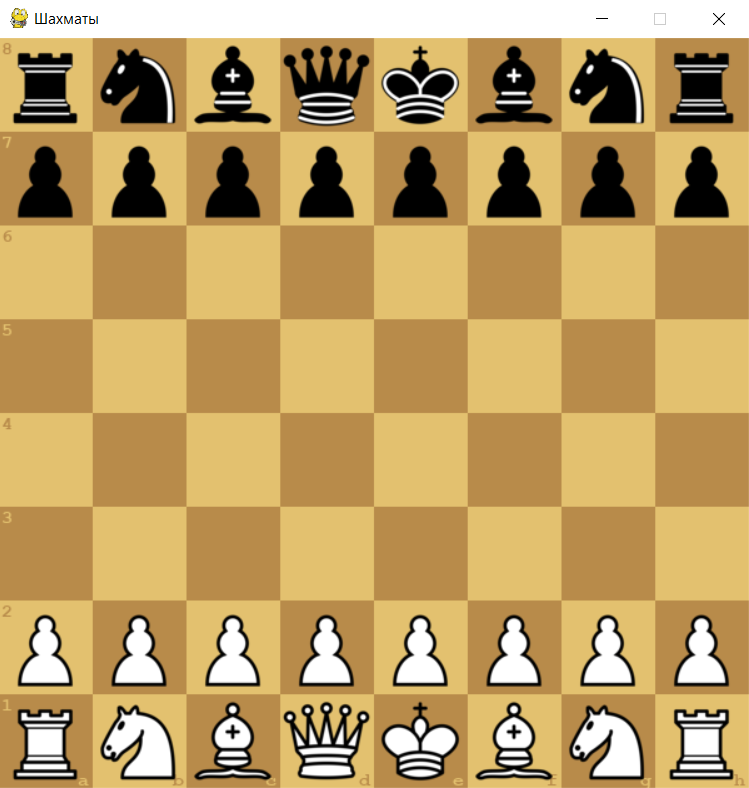

# Шахматы в pygame
Это настольная игра с использованием библиотеки Pygame.

## Геймплей
Эта игра поддерживает игру **Игрок против Игрока** и **Игрок против Компьютера**. В игре **Игрок против Компьютера**
можно играть и за чёрных, и за белых.

### Варианты режимов игры
- **До первого шаха**
- **Атомные (ядерные) шахматы**
- **Обратные шахматы (кто проигрывает, тот выигрывает)**
- **Шахматы без времени**
- **Мини-шахматы (5 на 5)**
- **Шахматы-960**
- **Шашки**
- **Марсельские шахматы (двойные ходы)**
- **Птичьи Шахматы (без взятия на проходе)**
